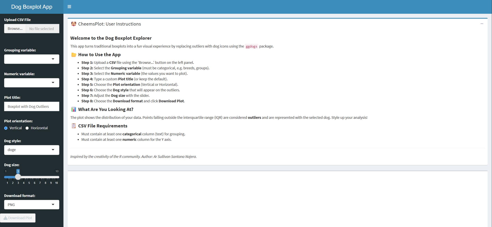
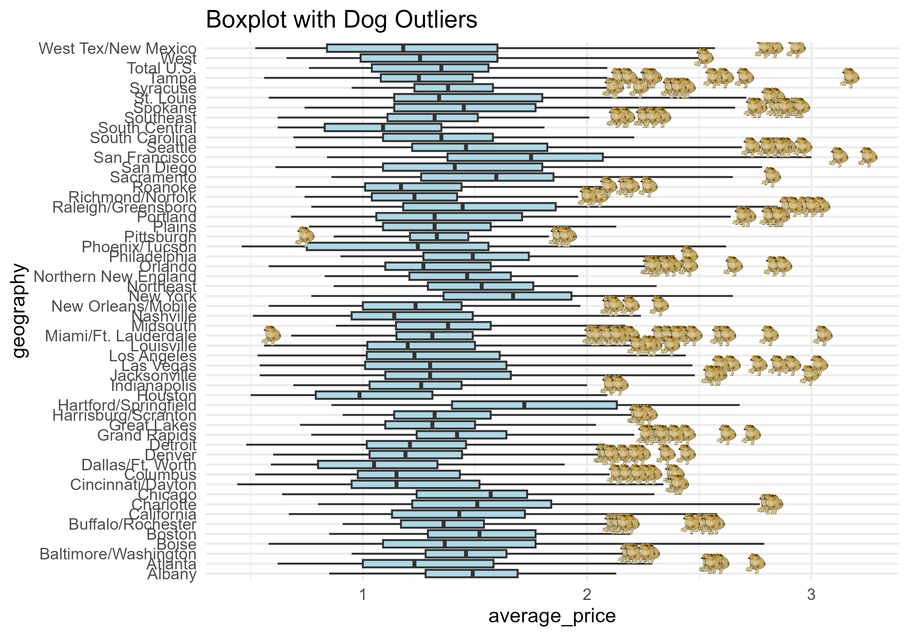

# 🐶 CheemsPlot: Interactive Dog-Styled Boxplot Explorer

An interactive Shiny dashboard that transforms traditional boxplots into a playful data visualization experience by replacing outliers with customizable 🐕 dog icons, powered by the [`ggdogs`](https://github.com/R-CoderDotCom/ggdogs) package.

Built as a single-file Shiny app (`app.R`), designed to run locally, live on GitHub, and deploy to **shinyapps.io** — with a clear migration path to **Posit Connect Cloud**.

---

## 🚀 Features

- 📂 **Upload your own CSV** — no hardcoded datasets required
- 🔄 **Dynamic variable selection** — categorical and numeric columns are auto-detected
- 📊 **Boxplots on the fly** — computed reactively as you change inputs
- 🐶 **Dog-styled outliers** — replace IQR outliers with 15+ dog icons
- 🎛 **Full customization** — dog style, dog size, orientation, and plot title
- 🖼 **Horizontal or vertical orientation** — toggle with a single click
- 💾 **Export your plot** — download as PNG, JPG, or PDF (300 dpi)
- 📘 **Built-in instructions panel** — users learn the app without leaving it
- 🎨 **Clean dashboard UI** — powered by `shinydashboard`

---

## 🐕 Available Dog Styles

`doge`, `doge_strong`, `chihuahua`, `eyes`, `gabe`, `glasses`, `tail`, `surprised`, `thisisfine`, `hearing`, `pug`, `ears`, `husky`, `husky_2`, `chilaquil`

All rendered through `geom_dog()` from the **ggdogs** package.

---

## 📦 Requirements

- **R** ≥ 4.2
- Packages:

```r
install.packages(c("shiny", "shinydashboard", "ggplot2", "dplyr", "readr", "remotes"))
remotes::install_github("R-CoderDotCom/ggdogs")
```

> ⚠️ `ggdogs` is **not on CRAN**. It must be installed from GitHub.

---

## ▶️ Run the App Locally

1. Clone the repository:

   ```bash
   git clone https://github.com/TU-USUARIO/CheemsPlot-Interactive-Dog-Styled-Boxplot-Explorer.git
   cd CheemsPlot-Interactive-Dog-Styled-Boxplot-Explorer
   ```

2. Open the project in RStudio.

3. Run the app:

   ```r
   shiny::runApp()
   ```

   Or simply open `app.R` in RStudio and click **Run App**.

---

## 📁 Project Structure

```
CheemsPlot-Interactive-Dog-Styled-Boxplot-Explorer/
│
├── app.R               # Main Shiny application (UI + Server)
├── README.md           # Project documentation (this file)
├── .gitignore          # Files excluded from Git
├── data/
│    └── ejemplo.csv     
└── Images/
     └── 01_InitialMenu.png
     └── 02_outcome.png
```

> `rsconnect/` is **never** committed — it holds deployment credentials.

---

## 📘 How to Use the App

The app guides you through 8 simple steps, all available from the sidebar:

### 📂 Step 1 — Upload a CSV file
Use the **Browse…** button in the left panel to upload your `.csv` file.
The app accepts standard comma-separated files with a header row.

### 📊 Step 2 — Select the Grouping variable
Choose the **categorical** column (e.g. breeds, groups, categories).
This variable is placed on the X axis and defines the groups of the boxplot.

### 📈 Step 3 — Select the Numeric variable
Choose the **numeric** column you want to plot.
This variable is placed on the Y axis and its distribution is summarized by the boxplot.

### ✏️ Step 4 — Type a custom Plot title
Write any title you want in the **Plot title** field.
If you leave it empty, the app falls back to the default title *"Boxplot with Dog Outliers"*.

### 🔄 Step 5 — Choose the Plot orientation
Pick between:
- **Vertical** — default layout, groups on the X axis
- **Horizontal** — flipped layout, groups on the Y axis (via `coord_flip()`)

### 🐶 Step 6 — Choose the Dog style
Select which dog icon will represent the outliers.
15 styles are available: `doge`, `doge_strong`, `chihuahua`, `eyes`, `gabe`, `glasses`, `tail`, `surprised`, `thisisfine`, `hearing`, `pug`, `ears`, `husky`, `husky_2`, `chilaquil`.

### 📏 Step 7 — Adjust the Dog size
Use the slider (range **1–10**) to control how big the dog icons appear on the plot.
Smaller values are subtler; larger values are more expressive.

### 💾 Step 8 — Download your plot
Choose the **Download format**:
- **PNG** — best for presentations and web
- **JPG** — smaller file size
- **PDF** — vector format, ideal for publications

Then click **Download Plot**. Files are exported at **10 × 7 inches** and **300 dpi** via `ggsave()`.

---

## 📊 What Are You Looking At?

The plot shows the distribution of your numeric variable across the groups defined by your categorical variable.

Points falling outside the **interquartile range (IQR)** are considered **outliers** and are represented with the selected dog icon instead of the default `ggplot2` outlier points.

Formally, an observation is flagged as an outlier when:

```
value < Q1 − 1.5 · IQR    or    value > Q3 + 1.5 · IQR
```

Style up your analysis — statistics doesn't have to be boring. 🐕

---

## 📋 CSV File Requirements

Your CSV must contain at least:

- **One categorical column** (text) → used for grouping on the X axis
- **One numeric column** → used for the Y axis

Example:

```csv
breed,weight
Labrador,30
Labrador,32
Labrador,31
Labrador,75
Beagle,10
Beagle,11
Beagle,9
Beagle,45
Pug,7
Pug,8
Pug,7.5
Pug,22
```

---

## ⚠️ Notes

- **No `install.packages()` inside `app.R`** — installation is the user's responsibility, not the app's.
- `library(ggdogs)` must stay at the **top level** of `app.R` so `rsconnect` can detect it when building the manifest.
- The app is fully **reactive**: changing any input regenerates the plot instantly.
- `ggsave()` is used for export, so plot dimensions and dpi are consistent across formats.
- No credentials or tokens are ever committed to the repository.

---

## 💡 Inspiration

Inspired by the creativity of the R community — especially the idea of using custom geoms like `ggdogs` to bring personality into statistical graphics.

---

## 🧠 Why This Project?

This app demonstrates:

- Interactive data visualization with **Shiny**
- Advanced **`ggplot2`** customization via custom geoms
- **Reactive programming** in R (`reactive()`, `observe()`, `downloadHandler()`)
- Clean separation of UI, server logic, and reusable plotting functions
- Reproducible deployment workflow: **local → GitHub → shinyapps.io / Connect Cloud**

---

## 📸 Outcome

### 🖥️ Initial Dashboard View

The app opens with a clean dashboard layout: a collapsible instructions panel at the top and an empty plot area ready to render once a CSV is uploaded.



---

### 🐶 Dashboard in Action

Once a CSV is uploaded and the variables are selected, the boxplot is rendered with dog icons replacing the outliers. The dog style, size, orientation, and title can all be customized from the sidebar.



---

## 📬 Author

**Ar Sullivan Santana Najera**

---

## ⭐ If You Like It…

Give the repo a star ⭐ and share it with someone who loves dogs *and* data.